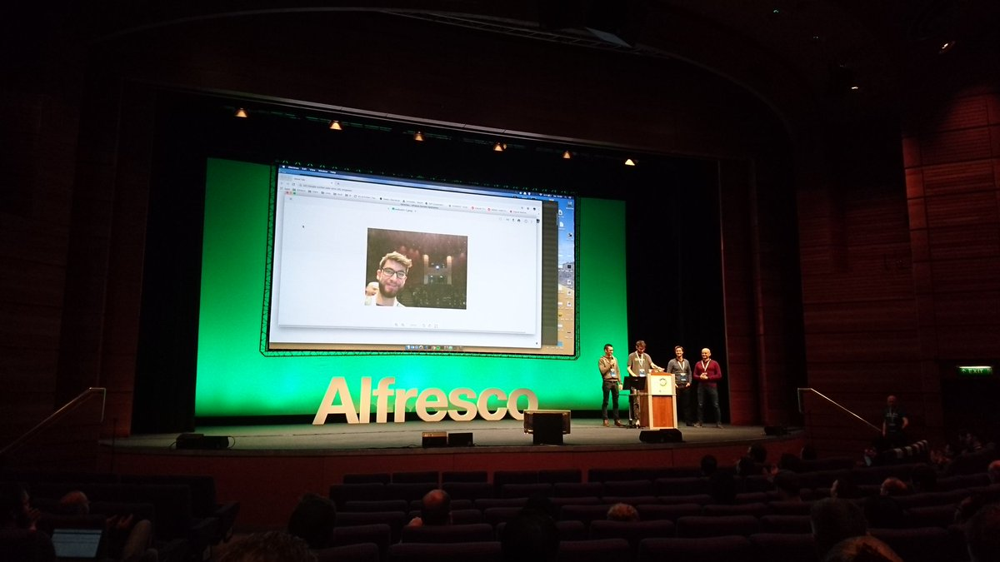

# electron-adf

[Hackathon Alfresco DevCon 2019](https://community.alfresco.com/docs/DOC-8064-projects-and-teams-hack-a-thon-at-devcon-2019):  <br/>

Electron is a Framework for developing cross platform desktop applications using JavaScript and a WebEngine. 
This project was build during the Alfresco DevCon Hackathon 2019. 
It implements an electron desktop application based on the Alfresco Content App (ADF). 

### Hackathon Team:
* Marius Grunenberg
* Lukas Ladenberger
* Andrej Lustin
* Alexander Seitz



## Hackathon Results / Features

The goal of this Alfresco Hackathon project was to look into the possilities from electron and 
marry them with the ADF based Alfresco Content App.

Features of this project:
* Shows an Alfresco logo icon in the Macbook touchbar
* Pressing the Alfresco logo on the Macbook touchbar &rarr; captures an image of the notebook camera and automatically upload the image to the user space of the alfresco repository
* Upload-Progress is shown in the system task bar 
* A system notification (Linux, Windows, macOS) is shown when the upload is complete

Example:


## Project Requirements

For Frontend:
* [NodeJS](https://nodejs.org/en/)

For Backend:
* [Docker](https://docs.docker.com/install/) with [Docker-Compose](https://docs.docker.com/compose/install/)
* Alfresco Content Services <br />
  use https://github.com/Alfresco/acs-community-deployment

## Install Node Dependencies
**for Electron**:

 ```
 npm install
 ```
 
**for Alfresco Content App**: 

  ```
  cd Content-App
  npm install
  ```

## Run

Fire up an Alfresco Content Services
```
cd acs-community-deployment/docker-compose
docker-compose up
```
and make sure that Alfresco Repository is up and running on port 8082.

For development we run electron and the adf app in separately consoles:

In the first console

run `npm start:adf` to start up Alfresco Content App

In a second console 

run `npm start:electron` to start up electron which uses the main.js as an entry point
